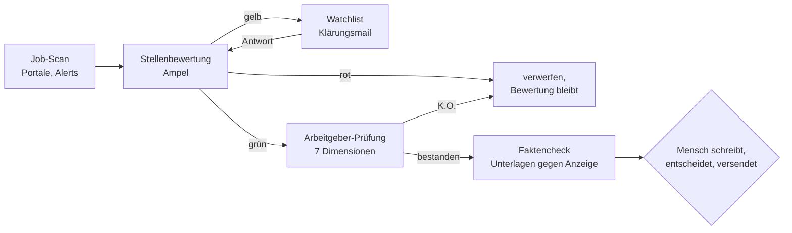

# KI-Assistenzsystem: Struktur statt längerer Prompts

Ein KI-Assistent ist nur so verlässlich wie die Struktur, in der er arbeitet.

Dieses Repo zeigt drei Systeme, die ich für meinen eigenen Alltag gebaut habe und täglich nutze: ein Kontext-Framework für KI-Projekte, ein Agenten-System für die Jobsuche und eine Postfach-Triage mit menschlicher Freigabe. Gebaut mit Claude und Claude Code, aber so angelegt, dass sich die Prinzipien auf andere Werkzeuge übertragen lassen.

Kein Framework zum Installieren. Eine Bauanleitung mit echten Beispielen.

---

## 1. Das Problem

Wer mit einem KI-Assistenten ernsthaft arbeitet, trifft auf drei Probleme.

**Er vergisst.** Jede Sitzung beginnt bei null. Regeln, die gestern erklärt wurden, sind heute weg.

**Er erfindet.** Fehlt eine Information, füllt das Modell die Lücke plausibel auf. Eine erfundene Gehaltsspanne sieht genauso überzeugend aus wie eine echte.

**Er driftet.** Steht dieselbe Regel in fünf Prompts, ist sie nach drei Wochen in fünf Varianten vorhanden. Welche gilt?

Die übliche Antwort ist ein längerer Prompt. Meine Antwort ist Struktur: Fakten in Dateien, Regeln an genau einem Ort, Unsicherheit sichtbar gemacht, und der Mensch entscheidet an den Stellen, an denen es zählt.

---

## 2. Das Kontext-Framework

Das Fundament aller drei Systeme ist eine einfache Ordnerkonvention aus Markdown-Dateien.

| Ebene | Inhalt | Beispiel |
|---|---|---|
| L0 | Projektanker: Was ist das hier, welche Dateien sind Wahrheit, welcher Ton gilt | `CLAUDE.md` |
| L1 | Modulregeln je Arbeitsbereich | `job-research/CLAUDE.md` |
| L2 | Datendateien: Fakten, die sich selten ändern | Profil, Kriterien, Zielrollen, Quellen |
| L3 | Prompts: Ziel, Regeln, Output-Vertrag | `prompts/evaluate-job.md` |
| L4 | Arbeitsergebnisse und Status | Bewertungen, Recherchen, Tracker |

Drei Regeln halten das System sauber:

1. **Eine Regel lebt in genau einer Datei.** Die K.O.-Kriterien für eine Stelle stehen in `criteria.md` und nirgends sonst. Jeder Prompt verweist darauf. Ändert sich ein Kriterium, ändert sich eine Zeile.
2. **Prompts enthalten keine Fakten.** Ein Prompt sagt, was zu tun ist und wie das Ergebnis aussieht. Was wahr ist, steht in den Datendateien.
3. **Jeder Prompt hat einen Output-Vertrag.** Dateiname, Ablageort, Höchstlänge, und welche anderen Dateien danach nachgezogen werden. So entsteht kein Ergebnis, das nur im Chatverlauf existiert.

> **Beispiel: der Output-Vertrag der Stellenbewertung**
>
> - **Datei:** `evaluation-output/2026-09-22_beispielfirma_ai-consultant_eval.md`
> - **Länge:** höchstens 300 Wörter
> - **Inhalt:** Ampel mit einem Satz Begründung, je eine Zeile pro Muss-Kriterium, erfüllte Soll-Kriterien, ATS-Keywords aus der Anzeige, offene Fragen
> - **Danach:** Bei Gelb wandert die Stelle mit Wiedervorlagedatum auf die Watchlist, und die Statusdatei wird nachgezogen.
>
> Wie ein Pflichtenheft, nur für die Ausgabe der KI. Der nächste Schritt kann sich darauf verlassen: Die Keywords aus dieser Datei sind der Input für den Faktencheck der Unterlagen.

Das Framework ist herstellerunabhängig. Es funktioniert mit Claude Code, lässt sich auf Cursor oder Windsurf übertragen und taugt auch als Kontext für API-Aufrufe. Ein Beispiel für den Projektanker liegt in [`beispiele/CLAUDE.beispiel.md`](beispiele/CLAUDE.beispiel.md).

### Vertrag statt Choreografie

Meine ersten Prompts waren Ablaufpläne: Schritt 1, Schritt 2, Phase 3, mit festen Schwellenwerten. Sie wurden lang, widersprachen sich und brachen, sobald eine Stellenanzeige nicht ins Schema passte.

Heute beschreibt jeder Prompt nur noch drei Dinge: das Ziel, die harten Regeln und den Output-Vertrag. Wie das Modell dorthin kommt, entscheidet es selbst. Die Prompts sind dadurch 300 bis 500 Wörter kurz. Ein kleineres Modell führt sie zuverlässig aus. Ein größeres nutze ich, um sie weiterzuentwickeln.

---

## 3. Das Agenten-System für die Jobsuche

Die Jobsuche ist ein guter Testfall: viele Daten, harte Kriterien, echte Konsequenzen. Das System führt eine Stelle vom Fund bis zu einer belastbaren Entscheidung: bewerben, klären oder verwerfen.



### Die Bausteine

**Job-Scan.** Durchsucht Portale und E-Mail-Alerts nach definierten Suchbegriffen und legt jede Stelle als Volltext-Datei an. Volltext, weil die späteren Schritte die genauen Formulierungen der Anzeige brauchen.

**Stellenbewertung.** Prüft zuerst die Muss-Kriterien. Ein Verstoß beendet die Bewertung. Unklare Punkte werden nicht geraten, sondern als konkrete Frage für eine Klärungsmail notiert. Das Ergebnis ist eine Ampel mit höchstens 300 Wörtern Begründung und eine Liste der ATS-Keywords, die später in den Lebenslauf einfließen. Prompt: [`beispiele/prompts/evaluate-job.md`](beispiele/prompts/evaluate-job.md).

**Arbeitgeber-Prüfung.** Pflicht vor jeder Bewerbung. Sieben Dimensionen von Eigentümerstruktur über Finanzen bis Kultur, mit festen Pflichtquellen (Bewertungsportale, Handelsregister, Jahresabschlüsse) und einer aktiven Suche nach Gegenbelegen. Zwei Dateien entstehen: ungekürzte Rohdaten als Beweisgrundlage und ein Bericht, der sich vollständig darauf zurückführen lässt. Prompt: [`beispiele/prompts/employer-check.md`](beispiele/prompts/employer-check.md).

**Recherche und Analyse.** Zwei getrennte Agenten, bewusst. Der Recherche-Agent sammelt Fakten und interpretiert nichts. Der Analyse-Agent zieht Schlüsse, bildet konkurrierende Hypothesen und greift die eigene Hauptaussage im Red Teaming an. Die Trennung verhindert, dass eine Vermutung unterwegs zur Tatsache wird. Prompts: [`recherche.md`](beispiele/prompts/recherche.md), [`analyse.md`](beispiele/prompts/analyse.md).

**Faktencheck der Unterlagen.** Formulierung und Entscheidung bleiben bei mir. Das System gleicht meine Unterlagen gegen die Anzeige und gegen eine Master-Datei mit meinen Belegen ab: Welche Anforderungen sind gedeckt, welche Begriffe der Anzeige fehlen, welche Aussage ist nicht belegt? Die Regel dabei: Nichts behaupten, was nicht belegt ist. Was die Anzeige fordert und mir fehlt, landet als Lücke in einer Notiz, damit ich sie im Gespräch ehrlich beantworten kann.

### Übergaben über Dateien

Die Agenten sprechen nicht miteinander. Sie lesen und schreiben Dateien. Die Bewertung liest die Stellenanzeige und schreibt einen Bericht. Die Arbeitgeber-Prüfung liest den Bericht. Der Faktencheck liest beides.

Das klingt primitiv und ist der größte Vorteil des Systems. Jede Übergabe ist nachvollziehbar, jedes Zwischenergebnis prüfbar, und ein Fehler lässt sich auf den Schritt zurückverfolgen, in dem er entstanden ist.

### Konfidenz als Pflichtfeld

Jede Aussage in Recherche und Arbeitgeber-Prüfung trägt eine Kennzeichnung:

| Label | Bedeutung |
|---|---|
| `[H]` | mindestens zwei Primärquellen (Register, Geschäftsbericht, Behörde) |
| `[M]` | eine Primärquelle plus Qualitätsjournalismus, oder zwei gute Sekundärquellen |
| `[N]` | nur Sekundärquellen oder Bewertungsportale |
| `[G]` | nicht belegbar oder widersprüchlich |

Der Analyse-Agent übernimmt diese Labels. Eine `[G]`-Aussage darf keine Empfehlung tragen. Widersprüche zwischen Quellen werden benannt, nicht geglättet. So sieht man einem Bericht an, wo er stark ist und wo er rät.

---

## 4. Governance: Der Mensch entscheidet

Beide großen Systeme folgen demselben Grundsatz: Die KI bereitet vor, der Mensch entscheidet an den Stellen, die sich nicht rückgängig machen lassen.

### Postfach-Triage

Ein automatisierter Lauf sortiert neue E-Mails nach einem festen Regelwerk in wenige, eindeutige Kategorien: zu erledigen, wartet auf andere, lesen, Referenz, Löschvorschlag. Das Regelwerk (bereinigt) liegt in [`beispiele/gmail-triage.beispiel.md`](beispiele/gmail-triage.beispiel.md).

Die Leitplanken:

- **Die KI löscht nie.** Sie setzt höchstens einen Löschvorschlag. Gelöscht wird von Hand, gesammelt und bewusst.
- **Unsicherheit bekommt einen eigenen Ort.** Liegt die Einschätzung unter etwa 85 %, landet die Mail in „manuell prüfen“ statt in einer geratenen Kategorie.
- **Belege sind geschützt.** Rechnungen und Quittungen werden nie zum Löschen vorgeschlagen, unabhängig vom Alter.
- **Fehler werden zur Regel.** Korrigiere ich eine falsche Einordnung, markiere ich die Mail. Jeder Lauf beginnt mit diesen Markierungen, leitet ab, welche Regel falsch oder unvollständig war, und meldet das. Die Regel ändere ich dann bewusst im Regelwerk.
- **Der Auftrag ist begrenzt.** Der automatische Lauf bearbeitet nur neue Mails. Der alte Bestand wird nur in gemeinsamen Sitzungen angefasst.

Der Ablauf dahinter: lernen, validieren, freigeben. Erst verstehen, was da ist. Dann gegen die Regeln prüfen. Dann entscheidet der Mensch.

### Jobsuche

- **Die KI versendet nichts.** Sie recherchiert, bewertet und prüft. Entscheiden, formulieren, absenden und Konten anlegen macht der Mensch.
- **Captchas und Logins löst der Mensch.** Die Recherche hält an, meldet die Stelle und macht danach weiter, statt abzubrechen oder sich eine Antwort zusammenzureimen.
- **Nicht belegte Behauptungen fliegen raus.** Auch wenn sie gut klingen. Die Notiz zum Lebenslauf führt jede Lücke offen auf, damit sie im Gespräch vorbereitet werden kann.
- **Versandfertig ist nicht versendet.** Der Tracker unterscheidet beides ausdrücklich. Das kam aus einem echten Fehler: Eine fertige Dankesmail lag gut zwei Wochen ungesendet im System.

---

## 5. Ergebnis

Stand September 2026, nach rund drei Monaten Betrieb:

- **83** Stellen erfasst, **81** bewertet
- **18** davon über die K.O.-Kriterien aussortiert, bevor Zeit hineinfloss
- **45** auf der Watchlist mit konkreter offener Frage und Wiedervorlagedatum
- **7** Arbeitgeber-Prüfungen mit Rohdaten und Bericht
- **7** Bewerbungen, jede mit eigenem Lebenslauf, eigenem Anschreiben und dokumentierten Portal-Antworten

Drei Beispiele, wo die Struktur den Unterschied gemacht hat:

**Die Klärungsmail als Filter.** Unklare Stellen bekommen eine kurze Mail mit zwei Fragen, meist Präsenztage und Gehaltsspanne. Von den an einem Abend versandten Mails kamen binnen 24 Stunden drei inhaltliche Antworten. Eine davon machte klar: 100 % Präsenz an einem Ort weit außerhalb meiner Region. Stelle aussortiert, ohne dass ein Lebenslauf geschrieben wurde.

**Die Lücke, die keine war.** Beim Abgleich mit einer Anzeige standen zwei Automatisierungswerkzeuge zunächst als „nicht belegt“. Mir fiel auf, dass ich eines davon in einem echten Projekt eingesetzt hatte, es aber nie dokumentiert war. Weil jede Aussage auf die Master-Datei zurückgeht, wurde der Beleg dort nachgetragen und floss danach in alle weiteren Bewerbungen, sauber als Projekterfahrung und nicht als Dauerpraxis.

**Gute Bewertungen, dünne Zahlen.** Ein Arbeitgeber glänzte auf den Bewertungsportalen. Die Pflichtquelle Jahresabschluss zeigte dagegen Verluste und eine niedrige Eigenkapitalquote. Kein K.O., aber die Gehaltsfrage rückte dadurch im Erstgespräch nach vorn. Ohne feste Pflichtquellen wäre nur das freundliche Bild geblieben.

---

## 6. Learnings

**Struktur schlägt Prompt-Länge.** Die größten Verbesserungen kamen nicht aus besseren Formulierungen, sondern daraus, Regeln an einen Ort zu verschieben und Fakten aus den Prompts herauszunehmen.

**Unsicherheit muss einen Namen haben.** Ein Modell, das „weiß ich nicht“ sagen darf, sagt es auch. Die Konfidenz-Labels und die Kategorie „manuell prüfen“ sind keine Bürokratie, sondern das, was die Ergebnisse vertrauenswürdig macht.

**Die Grenze zwischen KI und Mensch gehört ins Design.** Wo entscheidet der Mensch? Diese Frage beantworte ich, bevor ich einen Workflow baue, nicht danach. Die Antwort ist fast immer dieselbe: bei allem, was nach außen geht oder sich nicht zurückholen lässt.

**Dateien sind die beste Schnittstelle.** Was als Datei vorliegt, lässt sich prüfen, versionieren und von einem anderen Werkzeug weiterverwenden. Was nur im Chat steht, ist morgen weg.

---

## 7. Was ein Fachbereich davon übernehmen kann

Die Jobsuche ist nur der Anwendungsfall. Das Muster passt auf viele Prozesse in Unternehmen: Anfragen vorsortieren, Lieferanten prüfen, Dokumente gegen Regeln abgleichen.

Wer KI in einem Team einführt, kann vier Dinge direkt übernehmen:

1. **Regeln aus den Köpfen in Dateien holen.** Bevor ein Assistent eine Aufgabe übernimmt, muss aufgeschrieben sein, was richtig ist. Das hilft auch den Menschen.
2. **Jede Aufgabe mit einem Output-Vertrag versehen.** Was kommt heraus, wo liegt es, wie lang ist es, wer prüft es.
3. **Unsicherheit sichtbar machen.** Eine eigene Kategorie für unklare Fälle ist wertvoller als eine hohe Automatisierungsquote.
4. **Freigabepunkte festlegen, bevor gebaut wird.** Dann ist Governance kein Bremsklotz, sondern der Grund, warum das Team dem System vertraut.

---

## Inhalt dieses Repos

```
README.md                          dieses Dokument
beispiele/
  CLAUDE.beispiel.md               Projektanker des Kontext-Frameworks
  criteria.beispiel.md             Muss- und Soll-Kriterien als Vorlage
  gmail-triage.beispiel.md         Regelwerk der Postfach-Triage
  prompts/
    evaluate-job.md                Stellenbewertung mit Ampel
    employer-check.md              Arbeitgeber-Prüfung
    recherche.md                   strukturierte Recherche mit Konfidenz
    analyse.md                     Hypothesen, Red Teaming, Synthese
```

Die Beispiele sind aus dem laufenden System übernommen und von persönlichen Daten bereinigt: keine Namen, Firmen, Kontakte oder Beträge. Platzhalter stehen in eckigen Klammern.

---

**Oliver Klimek** · Hamburg · KI-Enablement, Prozessautomatisierung, Tool-Integration
[linkedin.com/in/0l1v3r](https://www.linkedin.com/in/0l1v3r)
